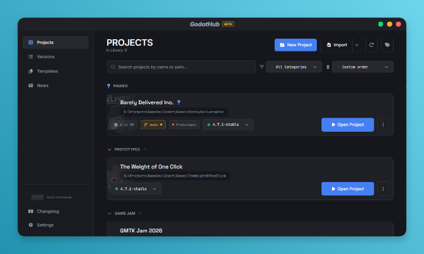
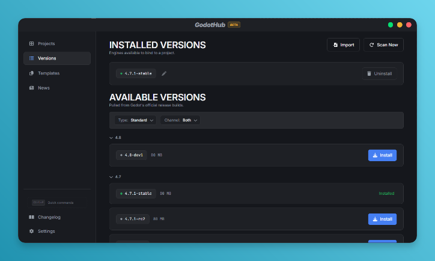
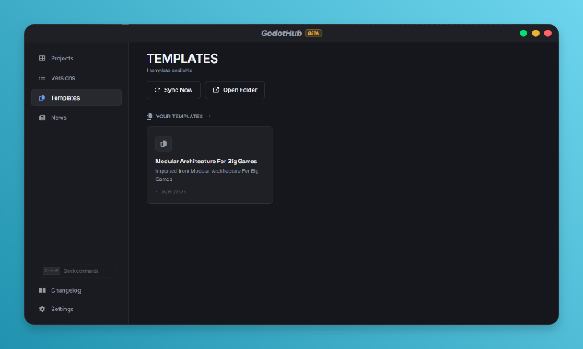
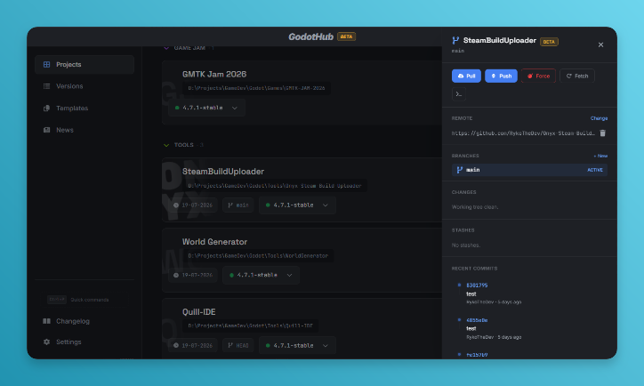
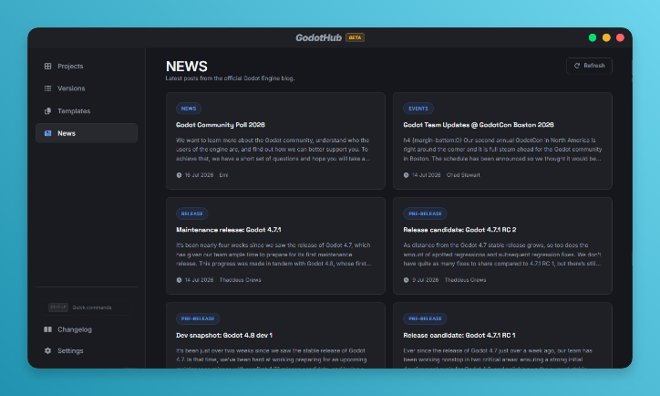
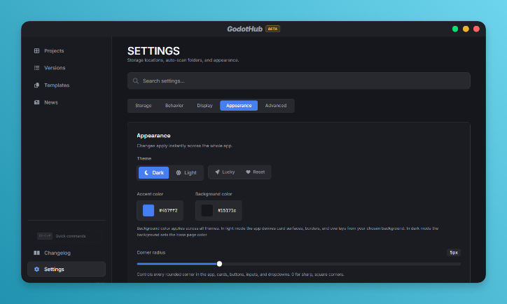

<p align="center">
  
</p>

<h1 align="center">🎮 GodotHub</h1>
<h3 align="center">The Ultimate Project Manager for Godot Engine</h3>

<p align="center">
  <strong>Manage projects, versions, templates, and Git - all in one place.</strong>
</p>

<p align="center">
  <a href="https://github.com/RykoTheDev/godothub/releases/latest">
    
  </a>
  
  
  
  
</p>

<p align="center">
  <i>"What if Unity Hub and GitHub Desktop had a baby, but it's adopted?" - Yeah.. That's exactly it.</i>
</p>

> ⚠️ **Note:** This app has only been tested on **Windows**. I cannot guarantee how it runs or behaves on Linux and macOS. If you find a bug, please [report it on Issues](https://github.com/RykoTheDev/godothub/issues) or contact me if you'd like to help with cross-platform testing or contributions.

<p align="center">
  <a href="https://github.com/RykoTheDev/godothub/releases/latest">
    <kbd>⬇️ Download Now</kbd>
  </a>
  &nbsp;&nbsp;&nbsp;
  <a href="#screenshots"><kbd>📸 Screenshots</kbd></a>
  &nbsp;&nbsp;&nbsp;
  <a href="#features"><kbd>📖 Features</kbd></a>
  &nbsp;&nbsp;&nbsp;
  <a href="#installation"><kbd>🛠️ Installation</kbd></a>
  &nbsp;&nbsp;&nbsp;
  <a href="#keyboard-shortcuts"><kbd>⌨️ Shortcuts</kbd></a>
</p>

---

## Screenshots

<p align="center">
  
  <br>
  <em>The Projects view with search, categories, and drag-and-drop sorting</em>
</p>

<br>

<table>
  <tr>
    <td width="50%" align="center">
      
      <br>
      <strong>🎯 Versions</strong>
      <br>
      <sub>Browse, download, and manage Godot versions</sub>
    </td>
    <td width="50%" align="center">
      
      <br>
      <strong>📦 Templates</strong>
      <br>
      <sub>Save and reuse project templates</sub>
    </td>
  </tr>
  <tr>
    <td width="50%" align="center">
      
      <br>
      <strong>🔄 Git Integration</strong>
      <br>
      <sub>Full Git management inside GodotHub</sub>
    </td>
    <td width="50%" align="center">
      
      <br>
      <strong>📰 News Feed</strong>
      <br>
      <sub>Stay up to date with Godot community news</sub>
    </td>
  </tr>
  <tr>
    <td width="50%" align="center" colspan="2">
      
      <br>
      <strong>🎨 Appearance & Settings</strong>
      <br>
      <sub>Deep customization with themes, accent colors, corner radius, and more</sub>
    </td>
  </tr>
</table>

> <sub>💡 Screenshots show the dark theme with default accent color. All visuals are customizable.</sub>

---

## Features

### Project Management

Take full control of your Godot projects with a rich, intuitive interface.

| Feature | Description |
|---|---|
| **Create & Import** | Create new projects from scratch or from templates, import existing ones from disk, or clone directly from Git repositories. |
| **Drag & Drop Reorder** | Rearrange projects with smooth drag-and-drop. Reorder within categories, or move between them. |
| **Pin Projects** | Pin your most important projects to a dedicated Pinned section at the top. |
| **Batch Operations** | Select multiple projects at once to change versions, assign categories, toggle pins, or remove from the library. |
| **Search & Filter** | Search by name or path, filter by category, and sort by custom order, name, date, last opened, or project size. |
| **Version Warnings** | Visual indicators when a project's bound Godot version is missing or has a major version mismatch. |
| **Project Properties** | Inspect detailed project info including file breakdown by type (scripts, scenes, images, audio, 3D models, etc.) with sizes and counts. |
| **Custom Launch Args** | Add custom command-line arguments when launching projects. |
| **Quick Actions** | Open project folder, open in external editor, open terminal at project path - all from the project card. |

### Godot Version Management

Download, install, and manage any Godot version effortlessly.

| Feature | Description |
|---|---|
| **Browse Releases** | Fetch the full list of official Godot builds directly from GitHub, filtered for your platform. |
| **Download & Install** | Download with progress tracking, resume support, and concurrent downloading (configurable up to 10 simultaneous). |
| **Import Versions** | Import existing Godot installations from any folder or drag-and-drop a `.zip` archive. |
| **Grouped Display** | Versions are grouped by `major.minor` with collapsible sections for easy browsing. |
| **Filtering** | Filter by build type (Standard / Mono / Both) and channel (Stable / Unstable / Both). |
| **Custom Names** | Give your installed versions friendly, custom names. |
| **Auto-Cleanup** | Prunes missing executables automatically from the registry. |

### Templates

Save time by reusing project structures.

| Feature | Description |
|---|---|
| **Save as Template** | Convert any existing project into a reusable template. |
| **Create from Template** | Start new projects pre-populated with template content. |
| **Preview Contents** | Browse the full directory tree of any template before using it. |
| **Sync from Directory** | Automatically import templates from a configured scan folder. |
| **File Watcher** | The template directory is watched for changes. Edit a template folder and the library updates automatically. |

### Git Integration

Full-featured Git management right inside GodotHub.

| Feature | Description |
|---|---|
| **Status Overview** | See branch name, uncommitted changes, and repo status at a glance. |
| **Stage / Unstage** | Stage and unstage individual files or all at once. |
| **Commit** | Write commit messages with optional amend. |
| **Push / Pull / Fetch** | Sync with remotes. |
| **Branch Management** | List, switch, create, and delete branches. |
| **Stash** | Push, list, apply, and drop stashes. |
| **Diff Viewer** | Inline diff viewer for changed files with syntax-colored additions and deletions. |
| **Discard Changes** | Discard all uncommitted changes with confirmation. |
| **Init & Remote** | Initialize a new Git repo, set or remove remotes. |
| **Undo** | Undo the last commit or undo a pull. |
| **Auto-Refresh** | Git status is polled every 30 seconds automatically. |

### Workspaces

Keep your projects organized with multiple workspaces.

| Feature | Description |
|---|---|
| **Multiple Workspaces** | Create separate workspaces for different projects, clients, or game jams. |
| **Custom Icons & Colors** | Each workspace gets a unique icon and color for quick visual identification. |
| **Quick Switch** | Switch between workspaces from the sidebar dropdown. |

### Categories

Organize projects with flexible, colorful categories.

| Feature | Description |
|---|---|
| **Create & Customize** | Create categories with custom names and colors from a rich palette. |
| **Collapsible Sections** | Collapse and expand category sections to keep the view clean. |
| **Drag Between Categories** | Drag projects between categories using `@dnd-kit` powered sorting. |
| **Filter by Category** | Filter the project list by any category. |
| **Enable / Disable** | Turn categories on or off globally from Settings. |

### News Feed

Stay up to date with the Godot community.

| Feature | Description |
|---|---|
| **RSS Feed** | Fetches and displays Godot-related news and updates. |
| **Cached** | Feed data is cached for performance. |
| **Open in Browser** | Click any news item to open the full article. |

### Appearance & Customization

Make GodotHub truly yours.

| Feature | Description |
|---|---|
| **Dark / Light Mode** | Switch between dark and light themes. |
| **Accent Color** | Choose from 18 preset accent colors or pick any custom hex color. |
| **Background Color** | Customize the background with presets or random generation. |
| **"Feeling Lucky"** | Randomly generate a unique color scheme in one click. |
| **Corner Radius** | Adjust from 0 (sharp) to 20px (rounded) - applies to every element. |
| **UI Density** | Scale padding and spacing from 75% (compact) to 125% (spacious). |
| **Font Scale** | Scale all text from 85% to 130%. |
| **Reduce Motion** | Minimize animations for accessibility. |
| **Sidebar Width** | Independently adjust expanded and collapsed sidebar widths. |

### Settings & Preferences

Deep configuration options for every aspect of the app.

| Feature | Description |
|---|---|
| **Storage Locations** | Configure scan directories for projects, Godot versions, and templates. |
| **Auto-Scan on Startup** | Automatically discover new projects and versions when the app starts. |
| **File Watchers** | Real-time detection of changes in project, version, and template directories. |
| **Download Concurrency** | Control how many Godot versions download simultaneously (1 to 10). |
| **Scan Depth** | Configure how deeply to scan folders (1 to 10 levels). |
| **Close on Launch** | Quit or minimize to tray when launching a project. |
| **Reopen After Godot Closes** | Automatically restore GodotHub when the editor closes. |
| **Tray Menu** | Recent projects in the system tray context menu (configurable count). |
| **Tooltip Delay** | Adjust tooltip hover delay from 100ms to 1000ms. |
| **Command Palette Keybind** | Rebinds `Ctrl/Cmd + <key>` to your preferred key. |
| **Export / Import** | Back up or transfer all settings as JSON. |
| **Reset & Wipe** | Reset settings to defaults or wipe all app data entirely. |

### Other Highlights

| Feature | Description |
|---|---|
| **Drag & Drop Import** | Drag project folders or `.zip` version archives directly into the app window. |
| **Command Palette** | `Ctrl/Cmd + P` (or your custom key) opens a powerful command palette for quick navigation. |
| **System Tray** | Minimize to tray with a right-click menu showing recently opened projects. |
| **Custom Titlebar** | A frameless window with a custom title bar for a polished, modern feel. |
| **Splash Screen** | An animated splash screen greets you on startup. |
| **Onboarding Wizard** | Guided first-time setup to configure scan folders, categories, and appearance. |
| **Auto-Updates** | Checks for updates on startup and downloads new versions automatically via Tauri updater. |
| **Bug Reporting** | Report issues directly from the app. |
| **Changelog Viewer** | Track what's new in each GodotHub release. |
| **Keyboard Shortcuts** | Full shortcut cheatsheet available at any time. |

---

## Installation

### Download Prebuilt Binaries

GodotHub is available as a desktop application for:

| Platform | Package Types |
|---|---|
| **Windows** | `.msi` or `.exe` installer |
| **macOS** | `.dmg` or `.app` bundle |
| **Linux** | `.deb`, `.AppImage`, or `.rpm` packages |

> [⬇️ Download the latest release](https://github.com/RykoTheDev/godothub/releases/latest)

### Build from Source

#### Prerequisites

| Dependency | Version | Purpose |
|---|---|---|
| [Bun](https://bun.sh) | >= 1.0 | JavaScript runtime & package manager |
| [Rust](https://rustup.rs) | Latest stable | Backend compilation |
| [Tauri 2 Prerequisites](https://v2.tauri.app/start/prerequisites/) | - | Platform-specific build tools |

#### Steps

```bash
# Clone the repository
git clone https://github.com/RykoTheDev/godothub.git
cd godothub

# Install frontend dependencies
bun install

# Run in development mode (with hot-reload)
bun tauri dev

# Build for production
bun tauri build
```

> The built application will be available in `src-tauri/target/release/bundle/`.

---

## Keyboard Shortcuts

| Shortcut | Action |
|---|---|
| `Ctrl/Cmd + 1` | Go to Projects |
| `Ctrl/Cmd + 2` | Go to Versions |
| `Ctrl/Cmd + 3` | Go to News |
| `Ctrl/Cmd + 4` | Go to Templates |
| `Ctrl/Cmd + N` | New Project |
| `Ctrl/Cmd + ,` | Open Settings |
| `Ctrl/Cmd + P` | Toggle Command Palette |
| `Escape` | Close overlay / Clear selection |

> The command palette keybind can be customized in Settings.

---

## Tech Stack

| Layer | Technology |
|---|---|
| **Frontend Framework** | [React 19](https://react.dev) + [TypeScript](https://www.typescriptlang.org/) |
| **Styling** | [Tailwind CSS 4](https://tailwindcss.com) |
| **Animations** | [Framer Motion](https://www.framer.com/motion/) |
| **Drag & Drop** | [@dnd-kit](https://dndkit.com/) |
| **Desktop Framework** | [Tauri 2](https://v2.tauri.app/) (Rust) |
| **Icons** | [Font Awesome Free](https://fontawesome.com) via [react-fontawesome](https://github.com/FortAwesome/react-fontawesome) |
| **HTTP Client** | [reqwest](https://docs.rs/reqwest/) (Rust) |
| **File Watchers** | [notify](https://docs.rs/notify/) (Rust) |
| **RSS Parsing** | [feed-rs](https://docs.rs/feed-rs/) (Rust) |
| **Build Tool** | [Vite](https://vitejs.dev) + [Bun](https://bun.sh) |

---

## Project Structure

```
godothub/
├── assets/                         # Screenshots & media
├── src/                            # Frontend (React + TypeScript)
│   ├── App.tsx                     # Root application component
│   ├── main.tsx                    # Entry point
│   ├── types.ts                    # TypeScript type definitions
│   ├── index.css                   # Global styles (Tailwind)
│   ├── components/
│   │   ├── git/                    # Git sidebar, diff viewer, result dialog
│   │   ├── modals/                 # All modal dialogs
│   │   ├── ui/                     # Primitive UI components
│   │   ├── Icons.tsx               # SVG icon components
│   │   ├── Titlebar.tsx            # Custom window title bar
│   │   ├── SplashScreen.tsx        # Startup splash animation
│   │   └── OnboardingTips.tsx      # First-time user tips
│   ├── hooks/                      # Custom React hooks
│   ├── lib/                        # Utility libraries & API bindings
│   └── views/                      # Main application views
│
├── WorkspaceSwitcher.tsx           # Workspace switching component
│
├── src-tauri/                      # Backend (Rust)
│   ├── src/
│   │   ├── main.rs                 # Application entry point
│   │   ├── lib.rs                  # Tauri setup, commands, tray menu
│   │   ├── models.rs               # Data models (serde)
│   │   ├── projects.rs             # Project CRUD, launch, icon resolution
│   │   ├── godot_versions.rs       # Version download, install, manage
│   │   ├── git.rs                  # Git operations
│   │   ├── settings.rs             # Settings persistence
│   │   ├── templates.rs            # Template management
│   │   ├── categories.rs           # Category CRUD
│   │   ├── changelog.rs            # Changelog CRUD
│   │   ├── workspace.rs            # Workspace management
│   │   ├── news.rs                 # RSS news fetching
│   │   ├── scan.rs                 # File system scanning
│   │   └── watcher.rs              # File system watchers
│   ├── Cargo.toml                  # Rust dependencies
│   └── tauri.conf.json             # Tauri configuration
│
├── CONTRIBUTING.md                 # Contribution guidelines
├── package.json                    # Frontend dependencies
├── vite.config.ts                  # Vite configuration
├── tsconfig.json                   # TypeScript configuration
└── README.md                       # This file
```

---

## Contributing

We welcome contributions of all kinds! Whether it's bug fixes, features, documentation, or feedback - every bit helps.

Here's how to get started:

1. **Fork** the repository
2. **Create a feature branch**: `git checkout -b feature/amazing-feature`
3. **Make your changes**
4. **Commit** using clear messages
5. **Push** to your fork
6. **Open a Pull Request**

> 📖 For detailed guidelines, see [CONTRIBUTING.md](CONTRIBUTING.md) which covers:
> - Development setup & architecture
> - Coding standards (TypeScript & Rust)
> - Commit conventions
> - Pull request process
> - Testing guidelines

---

## License

This project is licensed under the **MIT License**. See the [LICENSE](LICENSE) file for details.

---

## Acknowledgements

| Project | Why We're Grateful |
|---|---|
| [Godot Engine](https://godotengine.org) | The amazing open-source game engine this tool is built for. |
| [Tauri](https://v2.tauri.app) | The framework that makes cross-platform desktop apps with web technologies possible. |
| [React](https://react.dev) | The UI library we use for the frontend. |
| [Tailwind CSS](https://tailwindcss.com) | The utility-first CSS framework for styling. |
| [Font Awesome](https://fontawesome.com) | The icon library we use throughout the app. |

And every open-source library that makes GodotHub possible (see `package.json` and `Cargo.toml` for the full list).

---

<p align="center">
  Made with ❤️ by <a href="https://github.com/RykoTheDev">RykoTheDev</a>
</p>

<p align="center">
  <a href="https://github.com/RykoTheDev/godothub/releases/latest">⬇️ Download GodotHub</a>
  &nbsp;&middot;&nbsp;
  <a href="https://github.com/RykoTheDev/godothub/issues">🐛 Report a Bug</a>
  &nbsp;&middot;&nbsp;
  <a href="https://github.com/RykoTheDev/godothub/discussions">💬 Discussions</a>
</p>
